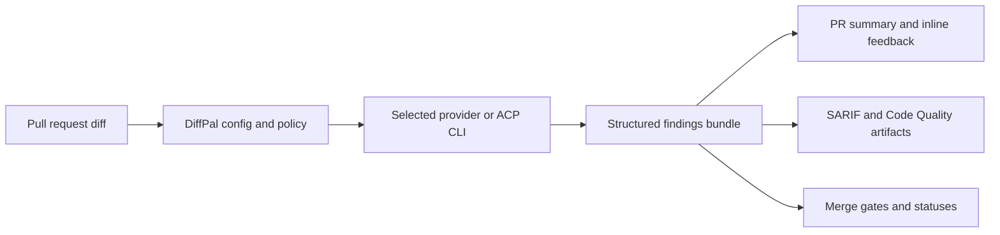

# DiffPal

[](https://github.com/diffpal/diffpal/actions/workflows/ci.yml)
[](https://github.com/diffpal/diffpal/actions/workflows/diffpal-dev-review.yml)
[](https://www.npmjs.com/package/@diffpal/diffpal)
[](LICENSE)

**Open-source AI PR review you control.**  
Bring your own agent. Keep one PR review workflow.

DiffPal turns pull request diffs into structured findings, summaries, inline
comments, and merge gates across GitHub, GitLab, and Azure DevOps without
locking your team into a hosted review platform.

[Get started in 5 minutes](docs/quickstart.md) ·
[Bring your own agent](docs/ci-examples.md#using-another-acp-cli) ·
[See examples](examples/README.md) ·
[Read the docs](docs/README.md)

## What DiffPal Publishes

DiffPal runs in CI and keeps the review output consistent even when teams use
different AI agents, accounts, or hosts.

| Output | Where it shows up |
| --- | --- |
| PR/MR summary | GitHub reviews, GitLab summaries, Azure PR threads |
| Actionable findings | Inline comments, discussions, or PR threads on changed lines |
| Review artifacts | `.artifacts/diffpal/findings.json`, summary Markdown, SARIF, Code Quality |
| Merge gates | CI exit status, checks, commit statuses, or PR statuses |

## Choose Your Path

| Goal | Start here |
| --- | --- |
| Fastest GitHub setup | [Quickstart](docs/quickstart.md) with the default GitHub Actions recipe |
| Keep an existing agent | [Generic ACP setup](docs/ci-examples.md#using-another-acp-cli) |
| Use GitLab or Azure DevOps | [CI setup guide](docs/ci-examples.md) |
| Tune policy and auditing | [Config reference](docs/config-reference.md), [findings schema](docs/findings-schema.md) |

## Why DiffPal

Most AI review products ask you to adopt their platform. DiffPal takes the
opposite approach: keep the agent your team already trusts, keep the CI system
you already operate, and standardize how review feedback is generated,
published, and gated.

- **Provider choice:** use Codex, Copilot, OpenCode, Gemini, Claude Code, a
  hosted provider, an ordered provider pool, or any ACP-compatible CLI.
- **Repository control:** review config, instructions, artifacts, and gates live
  with the codebase instead of behind a required hosted DiffPal service.
- **Structured outcomes:** DiffPal owns diff collection, findings validation,
  publishing, artifacts, and merge policy while your provider owns model
  reasoning and credentials.

## How DiffPal Works



Review instructions are produced by DiffPal's versioned Prompt Pack. Findings
artifacts include the prompt id, prompt version, purpose, and findings schema
version, so a review can be traced back to the prompt contract that generated
it. See the [config reference](docs/config-reference.md#prompt-pack) and
[findings schema](docs/findings-schema.md) for the current metadata.

## GitHub In 5 Minutes

The fastest path uses the Codex API-key recipe because it is a concrete
copy-paste GitHub Actions setup. Codex is not the product boundary; you can swap
the provider recipe and keep the same DiffPal workflow.

```bash
npx -y @diffpal/diffpal@latest init --wizard --setup codex-api-key --platform github
```

Then add `OPENAI_API_KEY` as a repository secret, copy the GitHub Actions
example, and open a trusted same-repository pull request:

```bash
mkdir -p .github/workflows
cp examples/ci/github-actions/codex-api-key.yml .github/workflows/diffpal.yml
```

After the first successful run you should see a `DiffPal Review Summary`,
inline findings when actionable issues exist, and
`.artifacts/diffpal/findings.json` in the job workspace. Read the
[quickstart](docs/quickstart.md) for the complete setup and fork-PR secret
guidance.

## Bring Your Own Agent

DiffPal delegates review to `diffpal.provider`, which points at an entry under
`runtime.providers`. Use `generic_acp` for any CLI that can start an ACP stdio
server:

```yaml
runtime:
  providers:
    my-review-agent:
      type: generic_acp
      generic_acp:
        cmd: ["your-acp-cli", "acp", "--stdio"]

diffpal:
  provider: my-review-agent
```

Install and authenticate that CLI in CI before running DiffPal. The rest of the
workflow stays the same: full git checkout, DiffPal config, provider secret,
platform token, review command, and optional gate.

## Platform Support

Use the same `.config/diffpal/config.yaml` shape across hosts. The CI file only
changes how the provider is installed, how credentials are passed, and which
publisher DiffPal runs.

| Host | Native outputs | Examples |
| --- | --- | --- |
| GitHub Actions | PR review summary, file-level review comments, SARIF | [`examples/ci/github-actions`](examples/ci/github-actions) |
| GitLab CI | MR summary, discussions, Code Quality, SARIF, status | [`examples/ci/gitlab`](examples/ci/gitlab) |
| Azure Pipelines | PR summary thread, PR threads, PR status | [`examples/ci/azure-pipelines`](examples/ci/azure-pipelines) |

GitHub users can also install the
[DiffPal Review action](https://github.com/marketplace/actions/diffpal-review)
with `uses: diffpal/action@v1`. Azure users can install the
[DiffPal Review extension](https://marketplace.visualstudio.com/items?itemName=diffpal.diffpal)
and use the `DiffPalReview@1` task.

## Documentation

- [Start here](docs/README.md)
- [Quickstart](docs/quickstart.md)
- [What success looks like](docs/what-success-looks-like.md)
- [CI setup guide](docs/ci-examples.md)
- [Examples gallery](examples/README.md)
- [Comparison guide](docs/comparison.md)
- [Troubleshooting](docs/troubleshooting.md)
- [Config reference](docs/config-reference.md)
- [Findings schema](docs/findings-schema.md)
- [GitLab adapter reference](docs/platform-gitlab.md)
- [Azure adapter reference](docs/platform-azure.md)
- [Contributing](CONTRIBUTING.md)
