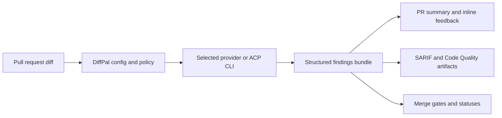

# How DiffPal Works

DiffPal is an open-source AI pull request review tool that runs in your CI
workflow. It lets teams bring their preferred AI provider or ACP-compatible CLI
while keeping one review workflow for findings, summaries, artifacts, and gates.

DiffPal owns diff collection, prompt and findings normalization, artifact
writing, platform publishing, and gate decisions. The selected provider owns
model reasoning, credentials, and provider-specific setup.

The same committed `.config/diffpal/config.yaml` shape works across GitHub,
GitLab, and Azure DevOps. CI-specific setup changes how the provider is
installed, how credentials are passed, and which host publisher DiffPal runs.

For the first setup path, start with the
[GitHub quickstart](../getting-started/github-quickstart.md). For supported
hosts and outputs, see the [support matrix](../reference/support-matrix.md).
