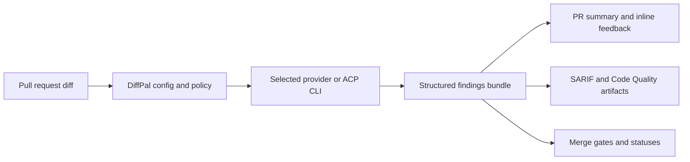

# Visual Assets Plan

DiffPal is easiest to understand when visitors can see the review outcome before
they read configuration details. Use this page as the maintainer checklist for
future screenshots, GIFs, and repository visuals.

## Hero Composite Screenshot

Show one pull request viewport containing:

- a `DiffPal Review Summary`
- one actionable inline finding
- the DiffPal check or status
- a small callout for `.artifacts/diffpal/findings.json`

Place the image near the README hero once the asset exists.

## First-Run GIF

Show the shortest successful path:

- run `diffpal init --wizard`
- commit `.config/diffpal/config.yaml`
- copy the CI workflow
- open a same-repository pull request
- see summary, inline finding, and findings bundle

Use this in `docs/quickstart.md` after the static quickstart is stable.

## Architecture Diagram

The README uses this Mermaid diagram until a designed diagram exists:

## Feedback Modes Visual

Create a side-by-side image for:

- `summary`: summary plus non-file artifacts
- `review`: summary plus platform-native file-level findings

Use it from the CI setup guide once the image exists.

## Social Preview Image

Create a repository social preview with:

- `DiffPal`
- `Open-source AI PR review you control`
- three proof points: `findings`, `comments`, `gates`
